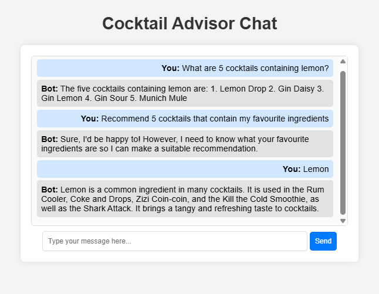

# 🍹 Cocktail Advisor Chat 🗨️  
A **FastAPI-based chat application** that integrates a **Hugging Face LLM** and **FAISS vector database** to provide **cocktail recommendations** and **ingredient-based searches** using **Retrieval-Augmented Generation (RAG)**.

---

## **🚀 Features**
- ✅ **Chatbot Interface** – Simple web-based UI for asking cocktail-related questions.  
- ✅ **LLM-Powered Answers** – Uses **OpenAI GPT-4** for intelligent responses.  
- ✅ **Vector Database (FAISS)** – Finds **similar cocktails** based on ingredients.  
- ✅ **Memory Storage** – Stores **user’s favorite ingredients** for personalized recommendations.  

---

## **🛠️ Tech Stack**
- **Backend**: FastAPI  
- **Frontend**: HTML, JavaScript  
- **LLM**: OpenAI GPT-4
- **Vector Database**: FAISS  
- **Dockerized**: Runs with `docker-compose`  

---

## **📦 Installation & Setup**

### **1️⃣ Clone the Repository**


```bash
1 git clone https://github.com/your-username/cocktail-advisor-chat.git
cd cocktail-advisor-chat


2 create .env file and configure it with:
OPENAI_API_KEY=your-api-key-here


3 Build & Start the Application
docker-compose up --build

✅ Wait until you see:
INFO:     Application startup complete.

**Example: 
INFO:     Will watch for changes in these directories: ['/app']
INFO:     Uvicorn running on http://0.0.0.0:8000 (Press CTRL+C to quit)
INFO:     Started reloader process [1] using StatReload
INFO:     Started server process [8]
INFO:     Waiting for application startup.
INFO:     Application startup complete.


🛠️ API Usage

**1️⃣ Test Chatbot with **curl

curl -X 'POST' 'http://localhost:8000/api/chat' \
     -H 'Content-Type: application/json' \
     -d '{"question": "What are the 5 cocktails containing lemon?"}'

2️⃣ Test with UI (Web Page)

Open your browser and go to:👉 http://localhost:8000


💡 Troubleshooting

1️⃣ OpenAI API Not Working?

Check your API key in .env file.

Make sure you have enough credits in OpenAI: 👉 https://platform.openai.com/account/usage

2️⃣ Errors in Docker?

Try rebuilding everything:

docker-compose down
docker-compose build --no-cache
docker-compose up


Sample usage:

